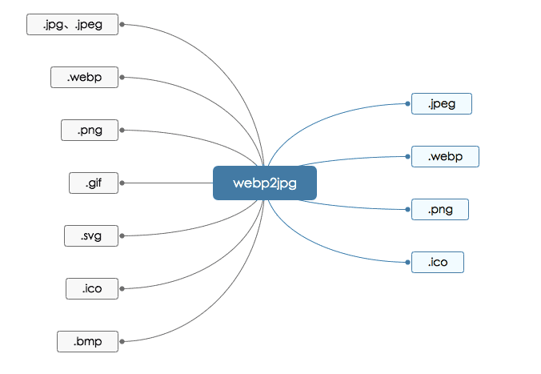

## webp2jpg-online 介绍




在线图片格式转化器, 可将jpeg、jpg、png、gif、webp、svg、ico、bmp文件转化为jpeg、png、webp、ico文件。无需上传文件，本地即可完成转换

Online picture format converter, can convert jpeg, jpg, png, gif, webp, svg, ico, bmp files into jpeg, png, webp, ico files. No need to upload files, conversion can be done locally。

## 在线地址

https://renzhezhilu.github.io/webp2jpg-online/

## demo


## 核心原理
[HTMLCanvasElement.toBlob()](https://developer.mozilla.org/zh-CN/docs/Web/API/HTMLCanvasElement/toBlob)
``` javascript
canvas.toBlob(callback, type, encoderOptions);
```

