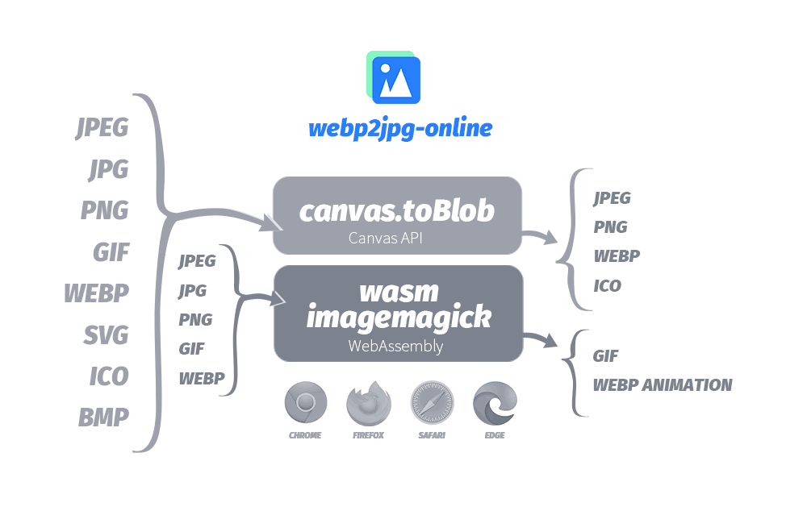

<center>


<!-- from shields.io/ -->


</center>

## webp2jpg-online 介绍

我常常需要把webp图片转成jpg格式，很多在线转化提供的功能都需要上传文件，不爽。有非上传的但是ui很难用，谷歌一番后了解到html5自带接口的canvas.toBlob有转换图片格式的功能，索性就自己搞这个webp2jpg-online。




在线图片格式转化器, 可将jpeg、jpg、png、gif、webp、svg、ico、bmp文件转化为jpeg、png、webp、ico、gif文件。无需上传文件，本地即可完成转换

Online picture format converter, can convert jpeg, jpg, png, gif, webp, svg, ico, bmp files into jpeg, png, webp, ico, gif files. No need to upload files, conversion can be done locally。

## 在线地址

https://renzhezhilu.github.io/webp2jpg-online/

## demo


## 🔧待解决
### 大问题

|#|修复|详细|日期|备注|
|---|-----|----|----|-----|
|1| ✅ |gif转webp时只能转第一帧|`2020-02-15`|已完成gif和webp互转 `2020-05-8`
|2| ⬜️ |gif和webp互转的速度太慢了吧，cpu都没跑慢噜|`2020-05-10`|-|
|3| ⬜️ |gif和webp互转有时会console报错，有时转完后文件画面出现层叠，不太行啊老弟|`2020-05-11`|-|

### 小问题

|#|修复|详细|日期|备注|
|---|-----|----|----|-----|
|1| ⬜️ |自定义选项只能增加不能删除啊？|`2020-05-15`|-|
|2| ⬜️ |不打包下载好像超过6，7个就只会下载6，7个，其他都不下载了？坑爹啊老弟...(并行改串行)|`2020-05-16`|-|
|3| ⬜️ |文件名如果有中文会乱码（改回原来的压缩库吧）|`2020-06-24`|-|
|4| ⬜️ |文件后缀名大写（如JPEG、WEBP）会被当作不支持格式！|`2020-07-01`|-|

### 重要功能
|#|完成|详细|日期|备注|
|---|-----|----|----|-----|
| 1 | ✅ |将jpeg、jpg、png、webp、svg、ico、bmp文件转化为jpeg、png、webp、ico文件|`2020-01-12`| 已完成`2020-02-23`|
| 2 | ✅ | gif动画和webp动画互转 | `2020-03-02` | 已完成`2020-05-10` |
| 3 | ⬜️ | 可选输出大小（如输出文件都在100kb以内） | `2020-07-01` | - |
| 4 | ⬜️ | 图片转换前后可拖拉对比 | `2020-07-01`  | - |

### 平台支持情况

||谷歌Chrome|火狐Firefox|苹果Safari|微软Edge|IE|
|---|-----|----|----|-----|---|
|Windows|✔️|✔️|-|✔️| ❌ 蛤？|
|Mac OS|✔️|✔️|✔️|✔️|-|
|Iphone|☑️|☑️| ✔️ | - |-|
|Android|?|?|?| -|-|

> ✔️ 运行良好 ☑️ 部分支持 ❌ 不支持 ? 未知

## 核心原理
### Canvas API

[HTMLCanvasElement.toBlob()](https://developer.mozilla.org/zh-CN/docs/Web/API/HTMLCanvasElement/toBlob)

<!-- https://codepen.io/random233/pen/PowBBaa?editors=1000 -->
``` javascript
canvas.toBlob(callback, type, encoderOptions);
```
### WebAssembly
[MDN:WebAssembly doc](https://developer.mozilla.org/zh-CN/docs/WebAssembly)

[wasm-im ](https://github.com/mk33mk333/wasm-im)

[文章：WebAssembly实战-在浏览器中使用ImageMagick](https://cloud.tencent.com/developer/article/1554176) 
 _[(快照)](https://renzhezhilu.github.io/webp2jpg-online/doc/WebAssembly实战-在浏览器中使用ImageMagick.html)


