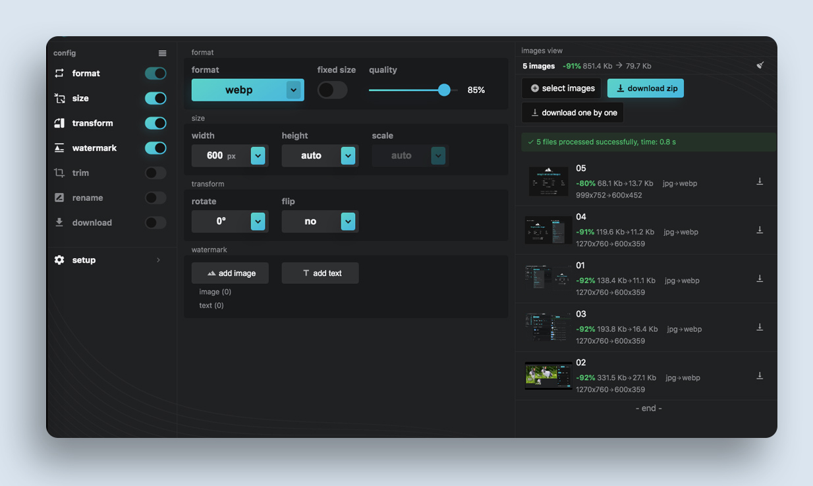
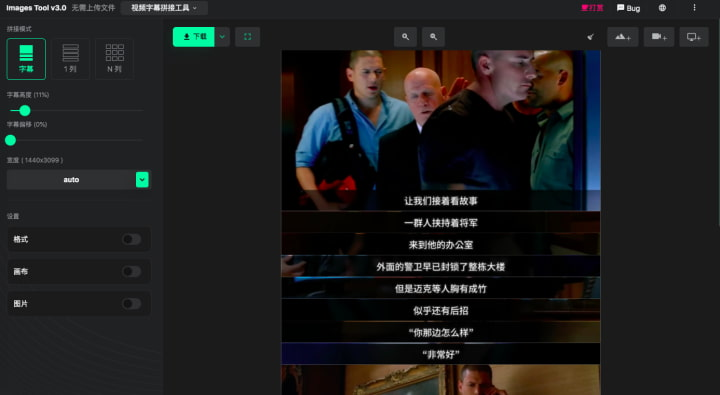

[English](./README.md) | 简体中文| [日本語](./README_JP.md)

<!--  -->
<h1>Webp2jpg-online</h1>
<!-- from shields.io/ -->

此工具箱包含图片转换和图片拼接，纯前端实现、速度快、保护隐私，支持离线使用,
支持20种语言。
    
    Q:为什么会命名webp2jpg？
    A:因为最开始是为了把webp转成jpg，就一直用着了。

## 在线地址
[图片转换](https://imagestool.com/webp2jpg-online/) 
| [图片拼接](https://imagestool.com/webp2jpg-online/splicing.html)

<h2>
    
    多功能图片转换器
</h2>

- [x] 支持将`psd`、`psb`、`hdr`、`heic`、`heif`、`tiff`、`jpg`、`gif`、`png`、`svg`、`bmp`、`tga`转换成`jpg`、`webp`、`png`、`gif`、`avif`
- [x] 支持`jpg`压缩(选择jpg-tiny)
- [x] 支持`png`压缩(png-tiny)
- [x] 支持`svg`压缩(svg-tiny)
- [x] 支持添加图片水印、文字水印
- [x] 支持按宽度、高度、比例修改尺寸
- [x] 支持动图`webp`和`gif`互转(webp-animation和gif-animation)
- [x] 支持动图水印 
- [x] 其他:base64输出，持久化选项数据、深色/浅色UI切换、对图片进行旋转和翻转、批量处理(1000张以内)、截图后按Ctrl+V导入

 
 

<h2>
    
    视频字幕拼接工具
</h2>

把视频的字幕拼接成长图片大家都见过吧～ 这个工具可以轻松制作所有形式的此类图片。

### 工作流程:

- 1.录屏
- 2.生成视频
- 3.一边播放视频一边截图
- 4.调整图片
- 5.完成
  
### 功能:

- [x] 支持录屏
- [x] 支持导入`mp4`文件
- [x] 录屏或导入后，可快捷键截图
- [x] 支持对导入后的图片进行裁切、拖动排序
- [x] 支持手机竖屏
- [x] 支持其他常规拼接功能(单列/单行、多行多列)
- [x] 支持调整边距和边框样式
- [x] 无损输出，不存在图片模糊的问题
- [x] 支持选择导出格式(`jpg`、`png`、`webp`)

### 小贴士
- `jpg`尺寸上限 `65525`
- `webp`尺寸上限 `16522`
- `png`尺寸上限 `65525`

## ❤ thanks

[科技爱好者周刊（第 114 期）：U 盘化生存和 Uber-job](http://www.ruanyifeng.com/blog/2020/07/weekly-issue-114.html)

[Multi-Functional Image Converter: An Online Tool to Batch Convert Images to Various Formats ](https://frontendfoc.us/issues/511)

#### [webp2jpg-online-demo](https://github.com/renzhezhilu/webp2jpg-online-demo)

## 开发者
本仓库为生产环境版本(3.0)，可任意使用。

<!-- 如果你想获得源代码和技术细节分享，欢迎加入[ohPic](https://github.com/ohPic)。 -->

